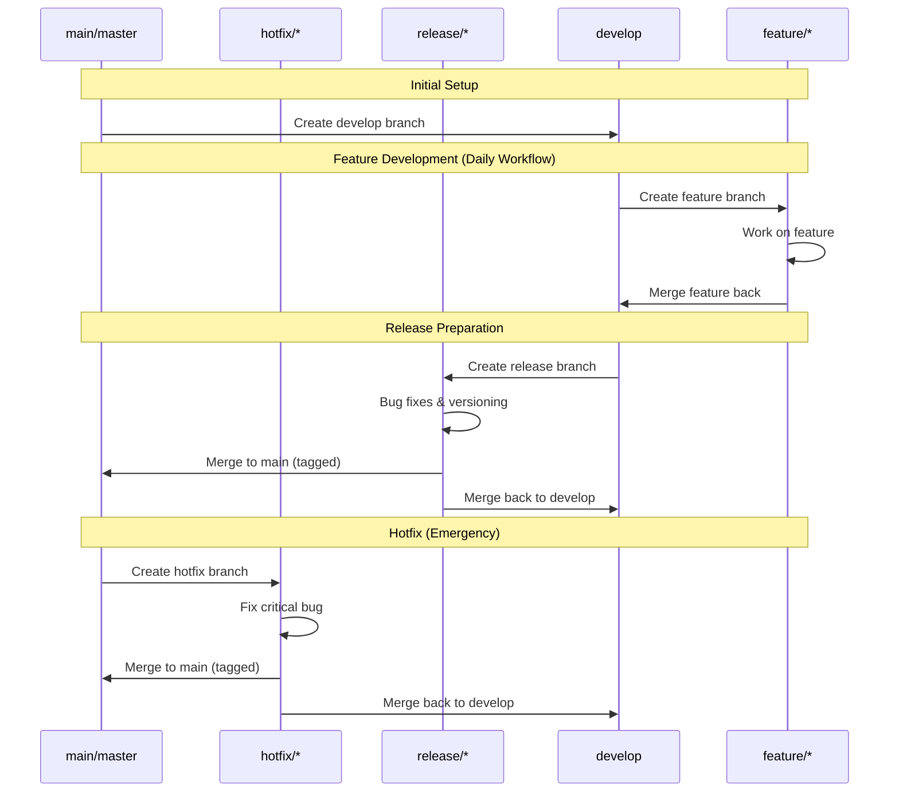

# Learn Gitflow in Y Minutes

Gitflow is a strict branching model that organizes development around features, releases, and hotfixes. It is designed for projects with scheduled, versioned releases.



# The Gitflow Branches

Gitflow uses five types of branches. The two primary, long-lived branches are `main` and `develop`. The other three (`hotfix`, `release`, `feature`) are temporary, supporting branches that are deleted after use.

## main (or master)

**Purpose:** Stores the official, tagged release history. This branch should only contain stable, production-ready code.

**DO NOT** commit directly to `main`. History is created by merging from `release` or `hotfix` branches.

## hotfix/\*

**Purpose:** To fix an urgent bug in production.

**Flow:** Branched from `main`, merged into `main` AND `develop`.

**Example:** See Workflow 3 below for details.

## release/\*

**Purpose:** To prepare a new production release (final bugs, versioning).

**Flow:** Branched from `develop`, merged into `main` AND `develop`.

**Example:** See Workflow 2 below for details.

## develop

**Purpose:** The primary integration branch for all new features. This branch represents the "next release" in development.

**Flow:** All feature branches are created from `develop` and merged back into it.

## feature/\*

**Purpose:** For developing new, non-urgent features.

**Flow:** Branched from `develop`, merged back into `develop`.

**Example:** See Workflow 1 below for details.

# Gitflow In Action

If you are starting a new project from scratch, you need to initialize Git and create the two main branches, `main` and `develop`.

### 1. Initialize your repository and create the main branch.

This is often the default branch, but `git init` might create `master`.

```bash
mkdir gitflow-example-project
cd gitflow-example-project
git init

# If the default branch is 'master', rename it to 'main'
# git branch -m master main

# Create an initial commit so you have a history to branch from
echo "Initial commit" > README.md
git add .
git commit -m "Initial commit"
```

### 2. Create the develop branch from main.

This is the last setup step. All future work (features) will branch from `develop`.

```bash
git checkout -b develop
```

If you are adding Gitflow to an existing project that already has a `main` branch, you just need to run `git checkout main`, `git pull`, and then `git checkout -b develop`.

## Workflow 1: Feature Branch (The "Daily" Loop)

For all new, non-urgent development.

### 1. Start a new feature. Always branch from develop.

Use a naming convention like `feature/...` or `[TICKET-ID]_[yourname]`

```bash
git checkout develop
git pull
git checkout -b feature/about-page
```

### 2. Do your work on the feature branch.

Make your commits.

```bash
# ...
echo "About page" > about.htm
git add .
git commit -m "Add about page"
# ...
echo "Page styling" > styles.css
git add .
git commit -m "Add styling for about page"
# ...
```

### 3. When the feature is complete, merge it back into develop.

We go back to `develop` first.

```bash
git checkout develop
git pull

# Merge the feature. `--no-ff` (no fast-forward) is often recommended
# to keep the feature's history grouped together in a merge commit.
git merge --no-ff feature/about-page
```

### 4. Delete the feature branch (locally and remotely).

```bash
git branch -d feature/about-page
# You only need to push the deletion if the branch was on the remote
# git push origin --delete feature/about-page
```

## Workflow 2: Release Branch (The "Release Prep" Loop)

When `develop` has enough features for a new release.

### 1. Create a release branch from develop.

Use a naming convention like `release/...`

```bash
git checkout develop
git pull
git checkout -b release/v1.0.0
```

### 2. On this branch, do only release-specific tasks.

Examples: Final bug fixes, updating version numbers, documentation.

**NO new features are added here.**

```bash
# (Fix a small bug)
git add .
git commit -m "Fix typo on homepage"

# (Update version file)
git add VERSION.txt
git commit -m "Bump version to 1.0.0"

# Note: Bugfixes here *can* be merged back into `develop` early if needed.
```

### 3. When the release is ready, finish it. This is a multi-step process.

#### Step 3a: Merge the release into main. This is what makes it "production".

```bash
git checkout main
git pull
git merge --no-ff release/v1.0.0
```

#### Step 3b: Tag the main branch with the new version.

```bash
git tag -a v1.0.0 -m "Version 1.0.0"
# Push the branch and the new tag
git push origin main
git push origin v1.0.0
```

#### Step 3c: Merge the release back into develop.

This is crucial! It ensures the final bugfixes and version bumps from the release branch get back into `develop` for the next cycle.

```bash
git checkout develop
git pull
git merge --no-ff release/v1.0.0
git push origin develop
```

#### Step 3d: Delete the release branch.

```bash
git branch -d release/v1.0.0
# git push origin --delete release/v1.0.0
```

## Workflow 3: Hotfix Branch (The "Emergency" Loop)

For urgent fixes needed in production (`main`).

### 1. Create a hotfix branch directly from main.

This is the only time a branch (other than `develop`) is created from `main`.

```bash
git checkout main
git pull
git checkout -b hotfix/critical-bug-123
```

### 2. Make the urgent fix.

```bash
# ...
git add .
git commit -m "Fix server crash on invalid input"
# ...
```

### 3. Finish the hotfix (similar to finishing a release).

#### Step 3a: Merge the hotfix into main.

```bash
git checkout main
git pull
git merge --no-ff hotfix/critical-bug-123
```

#### Step 3b: Tag the new hotfix version.

(Assuming prod was v1.0.0, this would be v1.0.1)

```bash
git tag -a v1.0.1 -m "Hotfix v1.0.1"
git push origin main
git push origin v1.0.1
```

#### Step 3c: Merge the hotfix back into develop.

Also crucial! This ensures the fix is not lost in the next release.

```bash
git checkout develop
git pull
git merge --no-ff hotfix/critical-bug-123
git push origin develop
```

#### Step 3d: Delete the hotfix branch.

```bash
git branch -d hotfix/critical-bug-123
# git push origin --delete hotfix/critical-bug-123
```

## Summary

- **main**: Production-ready code, always tagged.
- **hotfix/\***: Branched from `main`, merged into `main` AND `develop`.
- **release/\***: Branched from `develop`, merged into `main` AND `develop`.
- **develop**: Integration branch for the next release.
- **feature/\***: Branched from `develop`, merged into `develop`.

## Practice Exercise: A Full Flow

Let's walk through a full scenario.

You can run these commands in a new, empty directory to practice.

### 1. Setup: Create a new local repository.

```bash
mkdir gitflow-practice-exercise
cd gitflow-practice-exercise
git init
```

### 2. Setup: Create the main branch (if needed).

If `git init` created `master`, you can rename it:

```bash
git branch -m master main
```

### 3. Setup: Make an initial commit.

```bash
echo "Project Init" > README.md
git add .
git commit -m "Initial commit"
# Let's imagine we push this to a remote
# git remote add origin <your-remote-repo-url>
# git push -u origin main
```

### 4. Setup: Create the develop branch.

```bash
git checkout -b develop
# git push -u origin develop
```

### Scenario: Let's build v1.0.0

### 5. Feature: Start a new feature.

```bash
git checkout -b feature/add-login
echo "Login v1" > login.html
git add .
git commit -m "Add login page"
```

### 6. Feature: "Finish" the feature.

```bash
git checkout develop
git merge --no-ff feature/add-login
git branch -d feature/add-login
```

### 7. Release: develop looks good. Let's start the v1.0.0 release.

```bash
git checkout -b release/v1.0.0
```

### 8. Release: While on the release branch, we spot a bug.

```bash
echo "Login v1 - Fixed typo" > login.html
git add .
git commit -m "Fix typo in login page"
```

### 9. Release: We also bump the version.

```bash
echo "v1.0.0" > VERSION.txt
git add .
git commit -m "Bump version to 1.0.0"
```

### 10. Release: Finish the release!

```bash
# 10a. Merge into `main`
git checkout main
git merge --no-ff release/v1.0.0

# 10b. Tag it
git tag -a v1.0.0 -m "Version 1.0.0"

# 10c. Merge back into `develop`
git checkout develop
git merge --no-ff release/v1.0.0

# 10d. Clean up
git branch -d release/v1.0.0
```

### Scenario: Oh no! A production bug!

### 11. Hotfix: We are on v1.0.0 in production (main). Start a hotfix.

```bash
git checkout main
git checkout -b hotfix/critical-login-bug
```

### 12. Hotfix: Fix the critical bug.

```bash
echo "Login v1 - CRITICAL HOTFIX" > login.html
git add .
git commit -m "Fix critical production bug"
```

### 13. Hotfix: We need to release this as v1.0.1.

```bash
echo "v1.0.1" > VERSION.txt
git add .
git commit -m "Bump version to 1.0.1"
```

### 14. Hotfix: Finish the hotfix.

```bash
# 14a. Merge into `main`
git checkout main
git merge --no-ff hotfix/critical-login-bug

# 14b. Tag it
git tag -a v1.0.1 -m "Version 1.0.1"

# 14c. Merge back into `develop`
git checkout develop
git merge --no-ff hotfix/critical-login-bug

# 14d. Clean up
git branch -d hotfix/critical-login-bug
```

## You're all done!

You can run `git log --graph --oneline --all` at any time to see what your branch history looks like.
